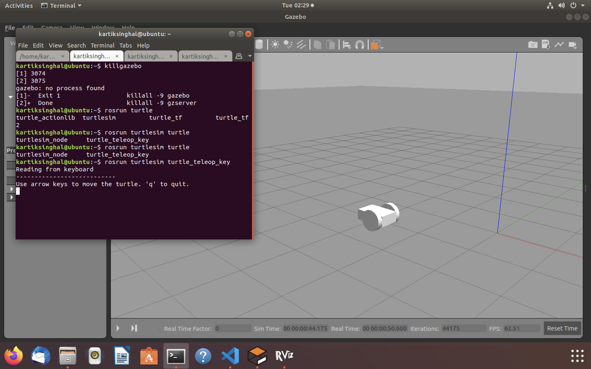

# differential_drive_ros

Launch the gazebo and rviz.

```
roslaunch diff_drive drive.launch model:='$(find diff_drive)/urdf/diff_drive.urdf'
```

then, run 'turtle_teleop_key' node in the 'turtlesim' package, which publishes to the spawner node when a key is pressed.

```
rosrun turtlesim turtle_teleop_key
```

Press arrow keys after making the turtle_teleop_key terminal window active, you should see robot moving in the simulation.


